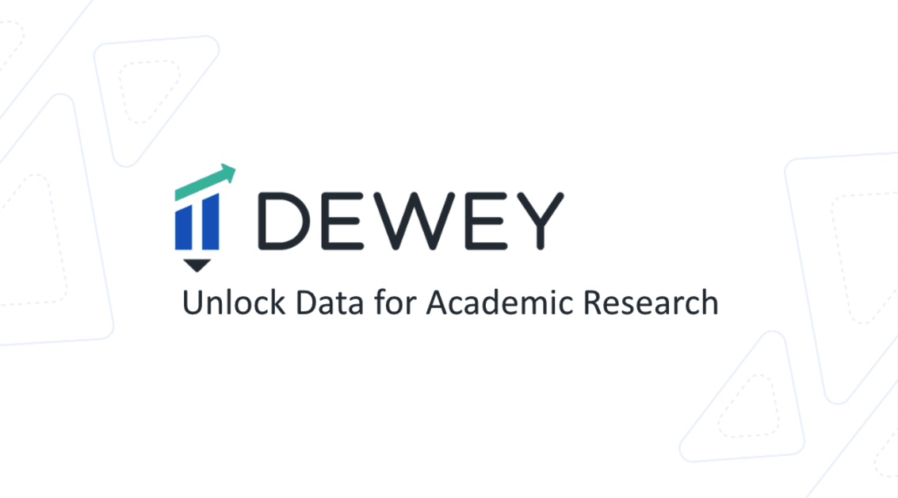

# Dewey Data Resources

  <table>
    <tr>
      <td></td>
      <td></td>
      <td></td>
    </tr>
  </table>
  
<i>Access to premium research data sources through Taylor Geospatial Institute and Sinquefield Center for Applied Economic Research</i>

## 🌐 Overview

This repository provides information about high-quality research data from world-class vendors available through Dewey for the Taylor Geospatial Institute in partnership with Sinquefield Center for Applied Economic Research at SLU.

---

## 📊 Available Data Categories & Vendors

### 💹 Financial Data
<table>
  <tr>
    <td width="20%" align="center">
      <b>7 Chord</b>
    </td>
    <td width="80%">
      Real-time predictive pricing metrics for fixed income assets, from 7 Chord's proprietary AI system. Analyze nearly 20,000 bonds.
    </td>
  </tr>
  <tr>
    <td align="center">
      <b>Exchange Data International</b>
    </td>
    <td>
      EDI is a trusted partner to the global financial community, delivering high-quality accurate securities reference data, corporate actions, and pricing information for derivatives, equities, fixed income, and investment funds worldwide.
    </td>
  </tr>
  <tr>
    <td align="center">
      <b>Context Analytics</b>
    </td>
    <td>
      Explore a structured feed of financial and marketing textual data, generated from a proprietary universal parser and Natural Language Processor.
    </td>
  </tr>
</table>

### 📍 Location & Mobility Data
<table>
  <tr>
    <td width="20%" align="center">
      <b>Advan Research</b>
    </td>
    <td width="80%">
      Understand consumer mobility at specific places (POI) or neighborhoods with foot traffic patterns data across the United States and Canada.
    </td>
  </tr>
  <tr>
    <td align="center">
      <b>dataplor</b>
    </td>
    <td>
      View dataplor's global point of interest (POI). Discover detailed business information such as location, business category, and more.
    </td>
  </tr>
  <tr>
    <td align="center">
      <b>SafeGraph</b>
    </td>
    <td>
      Browse SafeGraph's fresh and accurate points of interest (POI), building footprint, and consumer behavior data.
    </td>
  </tr>
  <tr>
    <td align="center">
      <b>Veraset</b>
    </td>
    <td>
      Access billions of precise and pseudonymized GPS signals from around the world, plus context about which places those pings are coming from.
    </td>
  </tr>
  <tr>
    <td align="center">
      <b>pass_by</b>
    </td>
    <td>
      Leverage pass_by's US consumer foot traffic insights with added brand context for academic research to study mobility, real estate, retail, brand loyalty, & more.
    </td>
  </tr>
</table>

### 🏢 Real Estate & Property Data
<table>
  <tr>
    <td width="20%" align="center">
      <b>ATTOM Data</b>
    </td>
    <td width="80%">
      ATTOM has built a national data warehouse that encompasses more than 155 million residential and commercial properties, multi-sourced from more than 3,000 U.S. counties.
    </td>
  </tr>
  <tr>
    <td align="center">
      <b>Builty</b>
    </td>
    <td>
      Builty provides unified intelligence of building permit data by collecting, enriching, and standardizing permit data from over 20,000 local jurisdictions across the United States.
    </td>
  </tr>
  <tr>
    <td align="center">
      <b>ClimateCheck</b>
    </td>
    <td>
      ClimateCheck is the first dataset to rate real estate based on expected changes to the world's climate. We empower researchers by exposing and quantifying the risks related to the climate crisis through our proprietary risk assessment methodology.
    </td>
  </tr>
  <tr>
    <td align="center">
      <b>RentHub</b>
    </td>
    <td>
      Detailed rental listing data, including address, location, property attributes, listing date, and marketing description.
    </td>
  </tr>
  <tr>
    <td align="center">
      <b>REsimpli</b>
    </td>
    <td>
      Access REsimpli's commercial real estate data with attributes including listing organization, listing type, property type, property name, photos, and more.
    </td>
  </tr>
</table>

### 🏛️ Business & Company Data
<table>
  <tr>
    <td width="20%" align="center">
      <b>BrightQuery</b>
    </td>
    <td width="80%">
      BrightQuery ("BQ") produces private and company data for all 42 million active US companies. They utilize government filings to produce a comprehensive view of all US legal entities and businesses in terms of Employment, Revenue, and Assets.
    </td>
  </tr>
  <tr>
    <td align="center">
      <b>People Data Labs</b>
    </td>
    <td>
      Company insights and workforce data including employee tenure, churn rates, work history, inferred revenue, and more for 28M+ companies worldwide.
    </td>
  </tr>
  <tr>
    <td align="center">
      <b>WARN Tracker</b>
    </td>
    <td>
      WARNtracker.com scrapes publicly available information about company layoffs from WARN notices. A WARN (Worker Adjustment and Retraining Notification) notice is a notice required by the federal WARN Act in the United States.
    </td>
  </tr>
  <tr>
    <td align="center">
      <b>IPinfo</b>
    </td>
    <td>
      IPinfo is the trusted source for IP address data with an enduring mission of providing the most accurate, reliable and actionable source of IP intelligence available anywhere. Using proprietary techniques and processing billions of queries each day.
    </td>
  </tr>
</table>

### 🛒 Consumer Behavior Data
<table>
  <tr>
    <td width="20%" align="center">
      <b>Consumer Edge</b>
    </td>
    <td width="80%">
      CE is a data and insights as a service (IaaS) company delivering views into consumer spending behavior aggregated by company and brand, coupled with deep industry knowledge and analytical expertise.
    </td>
  </tr>
  <tr>
    <td align="center">
      <b>Global Wireless Solutions</b>
    </td>
    <td>
      GWS Magnify provides a new, more measurable and meaningful way to understand smartphone engagement — what apps are being used, for how long and by which demographic. Built around an anonymized, opted-in consumer panel.
    </td>
  </tr>
  <tr>
    <td align="center">
      <b>PDI Technologies</b>
    </td>
    <td>
      POS transaction data including store ID, store location, discount information, loyalty program details, payment method, and basket items.
    </td>
  </tr>
  <tr>
    <td align="center">
      <b>OpenBrand</b>
    </td>
    <td>
      Access durable goods market & consumer survey data from OpenBrand for academic research into 10+ product categories, including purchase drivers & demographics.
    </td>
  </tr>
  <tr>
    <td align="center">
      <b>Similarweb</b>
    </td>
    <td>
      Learn more about website visit & organic traffic keyword data for major worldwide brands provided by Similarweb for use in academic research.
    </td>
  </tr>
</table>

### 🏭 Industry-Specific Datasets
<table>
  <tr>
    <td width="20%" align="center">
      <b>BP Environmental Services</b>
    </td>
    <td width="80%">
      BPES works with a network of haulers and equipment rental providers and sits on a rich corpus of ever-changing data associated with its transactions across over 20K customers annually, including contractors, builders, and more.
    </td>
  </tr>
  <tr>
    <td align="center">
      <b>Capology</b>
    </td>
    <td>
      Capology is committed to empowering transparency in the football industry. We specialize in providing comprehensive data on player salaries and club financial statements, offering a unique insight into the financial aspects of the sport.
    </td>
  </tr>
  <tr>
    <td align="center">
      <b>Civic Mapping Initiative</b>
    </td>
    <td>
      Geospatial data for community college campuses & technical schools, and their relation to public transportation, cleaned and ready to use for academic research.
    </td>
  </tr>
  <tr>
    <td align="center">
      <b>CustomWeather</b>
    </td>
    <td>
      Precise and detailed daily and hourly feeds of weather data from over 2000 weather stations in the United States.
    </td>
  </tr>
  <tr>
    <td align="center">
      <b>VIZION</b>
    </td>
    <td>
      Vizion aggregates detailed container tracking data for end-to-end supply chain visibility. Uncover greater supply chain visibility and analyze how efficiently ports are operating including changes over time.
    </td>
  </tr>
  <tr>
    <td align="center">
      <b>WageScape</b>
    </td>
    <td>
      Learn more about WageScape's labor market intelligence data available for use in academic research, including historical wage data by job title and location.
    </td>
  </tr>
  <tr>
    <td align="center">
      <b>Verisk</b>
    </td>
    <td>
      Verisk works at the intersection of people, data, and advanced technologies. Through proprietary platformed analytics, advanced modeling, and interpretation, we deliver immediate and sustained value to our customers.
    </td>
  </tr>
</table>

---

## 🔬 Featured Research

  
  
<b>Analyzing Urban Communities Based on POI Data</b>

Researchers at TGI found that MLB games create distinct spatial clusters of economic activity around stadiums, with spending increasing up to 38% at nearby businesses and varying significantly based on visiting teams.

📄 [Read the paper](https://www.mdpi.com/2076-3417/14/18/8134)

---

## 🔍 Research Applications

<table>
  <tr>
    <td align="center" width="20%">
       
      <b>Economic Research</b>
      <ul align="left">
        <li>Market analysis</li>
        <li>Investment trends</li>
        <li>Financial modeling</li>
        <li>Economic forecasting</li>
      </ul>
    </td>
    <td align="center" width="20%">
       
      <b>Consumer Intelligence</b>
      <ul align="left">
        <li>Spending patterns</li>
        <li>Brand loyalty</li>
        <li>Purchase drivers</li>
        <li>Market segmentation</li>
      </ul>
    </td>
    <td align="center" width="20%">
       
      <b>Real Estate Analytics</b>
      <ul align="left">
        <li>Property valuation</li>
        <li>Market trends</li>
        <li>Development patterns</li>
        <li>Climate risk assessment</li>
      </ul>
    </td>
    <td align="center" width="20%">
       
      <b>Business Intelligence</b>
      <ul align="left">
        <li>Competitive analysis</li>
        <li>Workforce trends</li>
        <li>Industry benchmarking</li>
        <li>Market opportunities</li>
      </ul>
    </td>
    <td align="center" width="20%">
       
      <b>Spatial Analysis</b>
      <ul align="left">
        <li>Movement patterns</li>
        <li>Location selection</li>
        <li>Foot traffic analysis</li>
        <li>Geographic targeting</li>
      </ul>
    </td>
  </tr>
</table>

---

## 🚀 Getting Started

  

### Request Process
To request access to Dewey data products:
1. Complete the [data access request form](https://survey123.arcgis.com/share/9e0581234c3c44358debda4ce041f026)
2. Prepare a brief description of your research objectives
3. Specify the dataset(s) required for your research
4. Receive access credentials after approval

### Data Specialists

<table>
  <tr>
    <td align="center">
       
      <b>Aviskar Giri</b> 
      Geospatial Data Scientist 
      <a href="mailto:aviskar.giri@taylorgeospatial.org">aviskar.giri@taylorgeospatial.org</a>
    </td>
    <td align="center">
       
      <b>Mark Korver</b> 
      Director, Data & Analytics 
      <a href="mailto:mark.korver@taylorgeospatial.org">mark.korver@taylorgeospatial.org</a>
    </td>
  </tr>
</table>

---

## 📅 Coming Soon

  <table>
    <tr>
      <td align="center">
         
        <b>Dataset Documentation</b>
      </td>
      <td align="center">
         
        <b>Access Instructions</b>
      </td>
      <td align="center">
         
        <b>Usage Examples</b>
      </td>
      <td align="center">
         
        <b>Data Integration Guides</b>
      </td>
    </tr>
  </table>

---

  
<i>A collaborative data initiative between Taylor Geospatial Institute and Sinquefield Center for Applied Economic Research at SLU</i>

